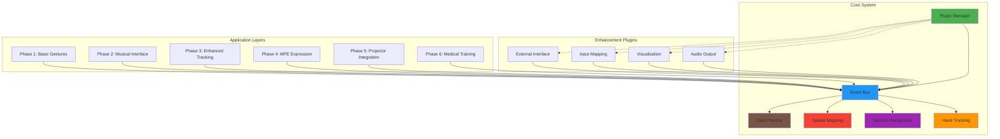
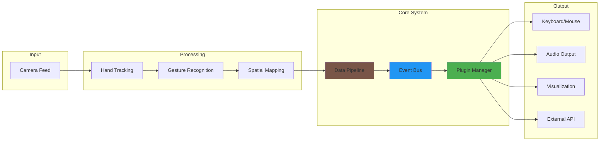
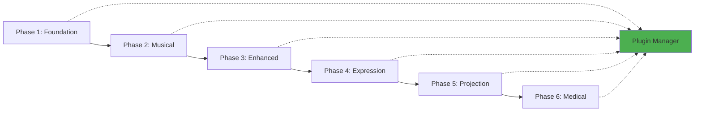

# 🏗️ Modular Blueprint for Spatial Computing Project
old version - use as reference only
last check time 8/18/2025 3:24pm

## Executive Summary

This document serves as the **single source of truth** for the spatial computing project, outlining a comprehensive modular architecture with plugin-based design. The system evolves from musical expression to medical training through a carefully designed phased approach, ensuring each phase builds incrementally without requiring major architectural changes.

**Core Philosophy:** Build a modular foundation that scales from simple gesture recognition to complex medical training applications through pluggable components rather than monolithic redesign.

---

## 📋 Table of Contents

1. [Modular Architecture Overview](#-modular-architecture-overview)
2. [Core Modules](#-core-modules)
3. [Pluggable Enhancement Modules](#-pluggable-enhancement-modules)
4. [Phase 1: Minimum Viable 3D Tracking](#-phase-1-minimum-viable-3d-tracking)
5. [Data Flow Architecture](#-data-flow-architecture)
6. [Existing Projects to Leverage](#-existing-projects-to-leverage)
7. [Streamlined Phase Structure](#-streamlined-phase-structure)
8. [Implementation Guidelines](#-implementation-guidelines)
9. [Performance Targets and Testing Strategy](#-performance-targets-and-testing-strategy)
10. [Resources and Documentation](#-resources-and-documentation)

---

## 🏛️ Modular Architecture Overview

### Design Principles

1. **Plugin-Based Architecture**: All non-core functionality implemented as plugins
2. **Event-Driven Communication**: Loose coupling through centralized event bus
3. **Standardized Interfaces**: Clear contracts between modules
4. **Incremental Enhancement**: New capabilities added without breaking existing functionality
5. **Hot-Swappable Components**: Plugins can be added/removed at runtime

### Architecture Diagram



---

## 🔧 Core Modules

These modules remain consistent across all phases and form the foundation of the system.

### 1. Hand Tracking Module

**Responsibility**: Detect and track hand landmarks using MediaPipe

```javascript
class HandTrackingModule {
    constructor(config) {
        this.mediaPipe = null;
        this.config = {
            maxHands: config.maxHands || 2,
            modelComplexity: config.modelComplexity || 1,
            minDetectionConfidence: config.minDetectionConfidence || 0.7,
            minTrackingConfidence: config.minTrackingConfidence || 0.5
        };
    }
    
    async initialize() {
        // Initialize MediaPipe Hands
        this.mediaPipe = new Hands({
            locateFile: (file) => `https://cdn.jsdelivr.net/npm/@mediapipe/hands/${file}`
        });
        
        this.mediaPipe.setOptions(this.config);
        return this.mediaPipe;
    }
    
    async processFrame(videoFrame) {
        const results = await this.mediaPipe.send({image: videoFrame});
        return this.normalizeResults(results);
    }
    
    normalizeResults(results) {
        // Standardize output format for all consumers
        return {
            timestamp: Date.now(),
            hands: results.multiHandLandmarks || [],
            handedness: results.multiHandedness || [],
            confidence: this.calculateOverallConfidence(results)
        };
    }
}
```

**Key Features**:
- Real-time hand detection and tracking
- 21-point landmark detection
- Handedness classification
- Confidence scoring
- Performance optimization for 30+ FPS

### 2. Gesture Recognition Module

**Responsibility**: Recognize gestures from hand landmarks

```javascript
class GestureRecognitionModule {
    constructor() {
        this.gestureLibrary = new Map();
        this.gestureHistory = [];
        this.hysteresisConfig = {
            triggerThreshold: 0.04,
            releaseThreshold: 0.06
        };
    }
    
    registerGesture(name, detector) {
        this.gestureLibrary.set(name, detector);
    }
    
    recognizeGestures(landmarks) {
        const recognizedGestures = [];
        
        for (const [gestureName, detector] of this.gestureLibrary) {
            const result = detector(landmarks);
            if (result.confidence > this.hysteresisConfig.triggerThreshold) {
                recognizedGestures.push({
                    name: gestureName,
                    confidence: result.confidence,
                    data: result.data
                });
            }
        }
        
        return this.applyHysteresis(recognizedGestures);
    }
    
    applyHysteresis(gestures) {
        // Prevent gesture flickering with hysteresis
        return gestures.filter(gesture => {
            const history = this.gestureHistory.filter(h => h.name === gesture.name);
            return history.length === 0 || 
                   gesture.confidence > this.hysteresisConfig.releaseThreshold;
        });
    }
}
```

**Key Features**:
- Extensible gesture library
- Hysteresis for stable recognition
- Confidence-based filtering
- Temporal gesture analysis
- Custom gesture registration

### 3. Spatial Mapping Module

**Responsibility**: Convert normalized coordinates to spatial positions

```javascript
class SpatialMappingModule {
    constructor(config) {
        this.coordinateSystem = config.coordinateSystem || 'normalized';
        this.calibrationData = null;
        this.spatialAnchors = new Map();
    }
    
    normalizeToWorldCoordinates(landmarks) {
        if (this.coordinateSystem === 'normalized') {
            return landmarks.map(point => ({
                x: point.x * 10 - 5,  // Scale to -5 to 5 range
                y: -point.y * 10 + 5, // Flip Y and offset
                z: -point.z * 10      // Depth scaling
            }));
        }
        return landmarks;
    }
    
    calculateQuaternion(landmarks) {
        // Calculate full 3D orientation from hand landmarks
        const wrist = landmarks[0];
        const indexMCP = landmarks[5];
        const middleMCP = landmarks[9];
        const pinkyMCP = landmarks[17];
        
        // Create coordinate system from hand landmarks
        const forward = this.normalize(this.subtract(indexMCP, wrist));
        const right = this.normalize(this.subtract(pinkyMCP, wrist));
        const up = this.cross(forward, right);
        
        return this.rotationMatrixToQuaternion({
            m11: right.x,   m12: up.x,   m13: forward.x,
            m21: right.y,   m22: up.y,   m23: forward.y,
            m31: right.z,   m32: up.z,   m33: forward.z
        });
    }
    
    createSpatialAnchor(id, position, quaternion) {
        this.spatialAnchors.set(id, {
            position,
            quaternion,
            timestamp: Date.now(),
            lastUpdate: Date.now()
        });
    }
}
```

**Key Features**:
- Coordinate system transformation
- Quaternion calculation
- Spatial anchoring
- Calibration management
- Multi-coordinate system support

### 4. Plugin Manager

**Responsibility**: Manage plugin lifecycle and communication

```javascript
class PluginManager {
    constructor() {
        this.plugins = new Map();
        this.eventBus = new EventBus();
        this.loadOrder = [];
    }
    
    async registerPlugin(PluginClass, config = {}) {
        const plugin = new PluginClass(config);
        
        // Validate plugin implements required interface
        this.validatePluginInterface(plugin);
        
        // Initialize plugin
        await plugin.initialize(this.eventBus);
        
        this.plugins.set(plugin.id, plugin);
        this.loadOrder.push(plugin.id);
        
        console.log(`🔌 Plugin registered: ${plugin.id} v${plugin.version}`);
        return plugin;
    }
    
    async unregisterPlugin(pluginId) {
        const plugin = this.plugins.get(pluginId);
        if (plugin) {
            await plugin.destroy();
            this.plugins.delete(pluginId);
            this.loadOrder = this.loadOrder.filter(id => id !== pluginId);
        }
    }
    
    validatePluginInterface(plugin) {
        const requiredMethods = [
            'initialize', 'start', 'stop', 'destroy',
            'processFrame', 'getCapabilities'
        ];
        
        for (const method of requiredMethods) {
            if (typeof plugin[method] !== 'function') {
                throw new Error(`Plugin ${plugin.id} missing required method: ${method}`);
            }
        }
    }
}
```

**Key Features**:
- Plugin lifecycle management
- Interface validation
- Dependency resolution
- Hot-swapping support
- Error handling and recovery

### 5. Event Bus

**Responsibility**: Facilitate communication between modules

```javascript
class EventBus {
    constructor() {
        this.listeners = new Map();
        this.eventHistory = [];
        this.maxHistorySize = 1000;
    }
    
    subscribe(eventType, callback) {
        if (!this.listeners.has(eventType)) {
            this.listeners.set(eventType, new Set());
        }
        this.listeners.get(eventType).add(callback);
        
        return () => this.unsubscribe(eventType, callback);
    }
    
    publish(eventType, data) {
        const event = {
            type: eventType,
            data: data,
            timestamp: Date.now()
        };
        
        this.eventHistory.push(event);
        if (this.eventHistory.length > this.maxHistorySize) {
            this.eventHistory.shift();
        }
        
        const callbacks = this.listeners.get(eventType);
        if (callbacks) {
            callbacks.forEach(callback => {
                try {
                    callback(event);
                } catch (error) {
                    console.error(`Error in event handler for ${eventType}:`, error);
                }
            });
        }
    }
    
    unsubscribe(eventType, callback) {
        const callbacks = this.listeners.get(eventType);
        if (callbacks) {
            callbacks.delete(callback);
        }
    }
}
```

**Key Features**:
- Publish-subscribe pattern
- Event history tracking
- Error isolation
- Type-safe event handling
- Performance optimization

### 6. Data Pipeline

**Responsibility**: Process and transform data between modules

```javascript
class DataPipeline {
    constructor(eventBus) {
        this.eventBus = eventBus;
        this.processors = new Map();
        this.dataCache = new Map();
    }
    
    registerProcessor(name, processor) {
        this.processors.set(name, processor);
    }
    
    async processData(inputData, processorChain) {
        let currentData = inputData;
        
        for (const processorName of processorChain) {
            const processor = this.processors.get(processorName);
            if (processor) {
                currentData = await processor(currentData);
            }
        }
        
        return currentData;
    }
    
    cacheData(key, data, ttl = 1000) {
        this.dataCache.set(key, {
            data: data,
            timestamp: Date.now(),
            ttl: ttl
        });
    }
    
    getCachedData(key) {
        const cached = this.dataCache.get(key);
        if (cached && Date.now() - cached.timestamp < cached.ttl) {
            return cached.data;
        }
        this.dataCache.delete(key);
        return null;
    }
}
```

**Key Features**:
- Chainable data processing
- Caching mechanism
- Data transformation
- Performance monitoring
- Error recovery

---

## 🔌 Pluggable Enhancement Modules

These modules provide additional functionality that can be added or removed based on phase requirements.

### 1. Audio Output Plugin

**Responsibility**: Generate audio output from gestures

```javascript
class AudioOutputPlugin {
    constructor(config) {
        this.id = 'audio_output';
        this.version = '1.0.0';
        this.audioContext = null;
        this.pianoGenie = null;
        this.soundLibrary = new Map();
    }
    
    async initialize(eventBus) {
        this.eventBus = eventBus;
        this.audioContext = new (window.AudioContext || window.webkitAudioContext)();
        
        // Load Piano Genie if available
        if (config.enablePianoGenie) {
            await this.loadPianoGenie();
        }
        
        // Subscribe to gesture events
        this.eventBus.subscribe('gesture.recognized', this.handleGesture.bind(this));
    }
    
    async processFrame(inputData) {
        // Process audio-related data
        if (inputData.gestures) {
            for (const gesture of inputData.gestures) {
                await this.playGestureSound(gesture);
            }
        }
        return inputData;
    }
    
    getCapabilities() {
        return {
            audioContext: true,
            pianoGenie: this.pianoGenie !== null,
            soundLibrary: Array.from(this.soundLibrary.keys()),
            maxPolyphony: 16
        };
    }
}
```

### 2. Visualization Plugin

**Responsibility**: Render 3D visualizations and overlays

```javascript
class VisualizationPlugin {
    constructor(config) {
        this.id = 'visualization';
        this.version = '1.0.0';
        this.scene = null;
        this.camera = null;
        this.renderer = null;
        this.handMeshes = new Map();
    }
    
    async initialize(eventBus) {
        this.eventBus = eventBus;
        this.setupThreeJS();
        
        // Subscribe to tracking events
        this.eventBus.subscribe('hand.tracked', this.updateHandVisualization.bind(this));
        this.eventBus.subscribe('gesture.recognized', this.highlightGesture.bind(this));
    }
    
    setupThreeJS() {
        // Initialize Three.js scene
        this.scene = new THREE.Scene();
        this.camera = new THREE.PerspectiveCamera(75, window.innerWidth / window.innerHeight, 0.1, 1000);
        this.renderer = new THREE.WebGLRenderer({ alpha: true });
        this.renderer.setSize(window.innerWidth, window.innerHeight);
        document.body.appendChild(this.renderer.domElement);
    }
    
    async processFrame(inputData) {
        // Update visualizations
        this.updateScene(inputData);
        this.renderer.render(this.scene, this.camera);
        return inputData;
    }
    
    getCapabilities() {
        return {
            threeJS: true,
            handVisualization: true,
            gestureHighlighting: true,
            spatialAnchors: true
        };
    }
}
```

### 3. Input Mapping Plugin

**Responsibility**: Map gestures to keyboard/mouse input

```javascript
class InputMappingPlugin {
    constructor(config) {
        this.id = 'input_mapping';
        this.version = '1.0.0';
        this.gestureMappings = new Map();
        this.debounceTime = config.debounceTime || 100;
        this.lastInputTime = 0;
    }
    
    async initialize(eventBus) {
        this.eventBus = eventBus;
        this.setupDefaultMappings();
        
        // Subscribe to gesture events
        this.eventBus.subscribe('gesture.recognized', this.handleGesture.bind(this));
    }
    
    setupDefaultMappings() {
        this.gestureMappings.set('open_hand', { type: 'keyboard', key: ' ' });
        this.gestureMappings.set('fist', { type: 'keyboard', key: 'Enter' });
        this.gestureMappings.set('index_point', { type: 'mouse', action: 'move' });
        this.gestureMappings.set('pinch', { type: 'mouse', action: 'click' });
    }
    
    async processFrame(inputData) {
        // Process input mappings
        if (inputData.gestures) {
            for (const gesture of inputData.gestures) {
                this.executeMapping(gesture);
            }
        }
        return inputData;
    }
    
    getCapabilities() {
        return {
            keyboardMapping: true,
            mouseMapping: true,
            customMappings: true,
            debounce: true
        };
    }
}
```

### 4. External Interface Plugin

**Responsibility**: Provide external API and integration points

```javascript
class ExternalInterfacePlugin {
    constructor(config) {
        this.id = 'external_interface';
        this.version = '1.0.0';
        this.apiEndpoints = new Map();
        this.webSocketServer = null;
        this.dataExporters = new Map();
    }
    
    async initialize(eventBus) {
        this.eventBus = eventBus;
        this.setupAPI();
        this.setupWebSocket();
        
        // Subscribe to system events
        this.eventBus.subscribe('system.data', this.broadcastData.bind(this));
    }
    
    setupAPI() {
        // Setup REST API endpoints
        this.apiEndpoints.set('/status', this.getStatus.bind(this));
        this.apiEndpoints.set('/gestures', this.getGestures.bind(this));
        this.apiEndpoints.set('/config', this.getConfig.bind(this));
    }
    
    async processFrame(inputData) {
        // Process external interface requests
        await this.handleAPIRequests();
        await this.handleWebSocketMessages();
        return inputData;
    }
    
    getCapabilities() {
        return {
            restAPI: true,
            webSocket: true,
            dataExport: true,
            remoteControl: true
        };
    }
}
```

---

## 🎯 Phase 1: Minimum Viable 3D Tracking

### Requirements

The minimum viable system for Phase 1 focuses on establishing the core tracking foundation with MediaPipe.

### Core Components

1. **MediaPipe Hand Tracking**: Basic hand detection and landmark extraction
2. **Simple Gesture Recognition**: 4-finger-to-thumb pinch detection
3. **3D Wrist Quaternion**: Full orientation tracking foundation
4. **Basic Visualization**: Wireframe hand rendering
5. **Event System**: Foundational event bus for communication

### Implementation

```javascript
// Phase 1: Core System Initialization
class Phase1System {
    constructor() {
        this.pluginManager = new PluginManager();
        this.eventBus = this.pluginManager.eventBus;
        this.dataPipeline = new DataPipeline(this.eventBus);
    }
    
    async initialize() {
        // Register core modules
        await this.pluginManager.registerPlugin(HandTrackingModule, {
            maxHands: 2,
            modelComplexity: 1
        });
        
        await this.pluginManager.registerPlugin(GestureRecognitionModule);
        await this.pluginManager.registerPlugin(SpatialMappingModule);
        
        // Register Phase 1 plugins
        await this.pluginManager.registerPlugin(InputMappingPlugin);
        await this.pluginManager.registerPlugin(VisualizationPlugin);
        
        // Setup data processing pipeline
        this.dataPipeline.registerProcessor('handTracking', this.processHandTracking.bind(this));
        this.dataPipeline.registerProcessor('gestureRecognition', this.processGestures.bind(this));
        this.dataPipeline.registerProcessor('spatialMapping', this.processSpatialData.bind(this));
    }
    
    async processFrame(videoFrame) {
        const processedData = await this.dataPipeline.processData(videoFrame, [
            'handTracking',
            'gestureRecognition',
            'spatialMapping'
        ]);
        
        // Publish processed data
        this.eventBus.publish('frame.processed', processedData);
        
        return processedData;
    }
}
```

### Success Criteria

- [ ] Hand tracking at 30+ FPS
- [ ] 4 pinch types recognized accurately with hysteresis
- [ ] 3D wrist quaternion calculation working
- [ ] Basic wireframe hand visualization
- [ ] Event system functioning properly
- [ ] Plugin system loading and managing modules

---

## 🔄 Data Flow Architecture

### Data Flow Diagram



### Data Processing Pipeline

1. **Raw Input**: Camera video frames
2. **Hand Tracking**: Extract 21-point landmarks
3. **Gesture Recognition**: Identify gestures from landmarks
4. **Spatial Mapping**: Convert to 3D coordinates and quaternions
5. **Event Distribution**: Publish processed data via event bus
6. **Plugin Processing**: Each plugin processes relevant data
7. **Output Generation**: Generate keyboard, audio, visual, or API output

### Event Types

```javascript
// Core System Events
'hand.detected'     // New hand detected
'hand.lost'         // Hand tracking lost
'hand.updated'      // Hand position updated
'gesture.recognized' // Gesture identified
'spatial.mapped'    // Spatial coordinates calculated

// Plugin Events
'audio.play'        // Play audio note
'visual.update'     // Update visualization
'input.mapped'      // Input mapping triggered
'api.request'       // External API request

// System Events
'system.started'    // System initialized
'system.error'      // System error occurred
'system.performance' // Performance metrics
```

---

## 🛠️ Existing Projects to Leverage

### 1. MediaPipe

**Purpose**: Hand tracking and landmark detection

**Integration**:
```javascript
// MediaPipe Hand Tracking Integration
class MediaPipeIntegration {
    constructor() {
        this.hands = null;
        this.config = {
            maxNumHands: 2,
            modelComplexity: 1,
            minDetectionConfidence: 0.7,
            minTrackingConfidence: 0.5
        };
    }
    
    async initialize() {
        this.hands = new Hands({
            locateFile: (file) => `https://cdn.jsdelivr.net/npm/@mediapipe/hands/${file}`
        });
        
        this.hands.setOptions(this.config);
        this.hands.onResults(this.onResults.bind(this));
    }
    
    onResults(results) {
        // Process MediaPipe results
        const processedData = {
            landmarks: results.multiHandLandmarks,
            handedness: results.multiHandedness,
            timestamp: Date.now()
        };
        
        this.eventBus.publish('mediapipe.results', processedData);
    }
}
```

**Benefits**:
- Real-time hand tracking
- 21-point landmark detection
- Cross-platform support
- High performance
- Active development

### 2. Three.js

**Purpose**: 3D visualization and rendering

**Integration**:
```javascript
// Three.js Visualization Integration
class ThreeJSIntegration {
    constructor() {
        this.scene = null;
        this.camera = null;
        this.renderer = null;
        this.handObjects = new Map();
    }
    
    async initialize() {
        this.setupScene();
        this.setupLighting();
        this.setupRenderer();
        
        // Subscribe to hand tracking events
        this.eventBus.subscribe('hand.updated', this.updateHandVisualization.bind(this));
    }
    
    updateHandVisualization(event) {
        const { handId, landmarks, quaternion } = event.data;
        
        let handObject = this.handObjects.get(handId);
        if (!handObject) {
            handObject = this.createHandObject(handId);
            this.handObjects.set(handId, handObject);
        }
        
        // Update hand object position and orientation
        handObject.position.set(landmarks[0].x, landmarks[0].y, landmarks[0].z);
        handObject.quaternion.set(quaternion.x, quaternion.y, quaternion.z, quaternion.w);
    }
}
```

**Benefits**:
- Powerful 3D rendering
- Cross-browser compatibility
- Large ecosystem
- Performance optimized
- Easy to integrate

### 3. Piano Genie

**Purpose**: Musical note generation from gestures

**Integration**:
```javascript
// Piano Genie Integration
class PianoGenieIntegration {
    constructor() {
        this.pianoGenie = null;
        this.model = null;
        this.currentNotes = new Map();
    }
    
    async initialize() {
        // Load Piano Genie model
        this.pianoGenie = new PianoGenie();
        await this.pianoGenie.loadModel();
        
        // Subscribe to gesture events
        this.eventBus.subscribe('gesture.recognized', this.processGesture.bind(this));
    }
    
    processGesture(event) {
        const { gesture, handPosition } = event.data;
        
        if (gesture.name === 'pinch') {
            const note = this.pianoGenie.generateNote(handPosition);
            this.playNote(note);
        }
    }
    
    playNote(note) {
        // Play note using Web Audio API
        const oscillator = this.audioContext.createOscillator();
        const gainNode = this.audioContext.createGain();
        
        oscillator.connect(gainNode);
        gainNode.connect(this.audioContext.destination);
        
        oscillator.frequency.value = note.frequency;
        oscillator.type = 'sine';
        
        gainNode.gain.setValueAtTime(0.3, this.audioContext.currentTime);
        gainNode.gain.exponentialRampToValueAtTime(0.01, this.audioContext.currentTime + 0.5);
        
        oscillator.start(this.audioContext.currentTime);
        oscillator.stop(this.audioContext.currentTime + 0.5);
    }
}
```

**Benefits**:
- ML-powered music generation
- Gesture-to-note mapping
- Real-time performance
- Expressive control
- Educational value

### 4. Web Audio API

**Purpose**: Audio synthesis and processing

**Integration**:
```javascript
// Web Audio API Integration
class WebAudioIntegration {
    constructor() {
        this.audioContext = null;
        this.masterGain = null;
        this.effects = new Map();
    }
    
    async initialize() {
        this.audioContext = new (window.AudioContext || window.webkitAudioContext)();
        this.masterGain = this.audioContext.createGain();
        this.masterGain.connect(this.audioContext.destination);
        
        this.setupEffects();
    }
    
    setupEffects() {
        // Reverb
        const convolver = this.audioContext.createConvolver();
        this.effects.set('reverb', convolver);
        
        // Delay
        const delay = this.audioContext.createDelay();
        delay.delayTime.value = 0.3;
        this.effects.set('delay', delay);
        
        // Filter
        const filter = this.audioContext.createBiquadFilter();
        filter.type = 'lowpass';
        filter.frequency.value = 1000;
        this.effects.set('filter', filter);
    }
    
    playNote(frequency, duration = 0.5, effects = []) {
        const oscillator = this.audioContext.createOscillator();
        const gainNode = this.audioContext.createGain();
        
        let currentNode = oscillator;
        
        // Apply effects
        for (const effectName of effects) {
            const effect = this.effects.get(effectName);
            if (effect) {
                currentNode.connect(effect);
                currentNode = effect;
            }
        }
        
        currentNode.connect(gainNode);
        gainNode.connect(this.masterGain);
        
        oscillator.frequency.value = frequency;
        oscillator.type = 'sine';
        
        gainNode.gain.setValueAtTime(0.3, this.audioContext.currentTime);
        gainNode.gain.exponentialRampToValueAtTime(0.01, this.audioContext.currentTime + duration);
        
        oscillator.start(this.audioContext.currentTime);
        oscillator.stop(this.audioContext.currentTime + duration);
    }
}
```

**Benefits**:
- Native browser support
- Low-latency audio
- Real-time processing
- Rich effects
- No external dependencies

### 5. WebXR

**Purpose**: Augmented and virtual reality capabilities

**Integration**:
```javascript
// WebXR Integration
class WebXRIntegration {
    constructor() {
        this.xrSession = null;
        this.xrReferenceSpace = null;
        this.xrHitTestSource = null;
    }
    
    async initialize() {
        if ('xr' in navigator) {
            // Check for WebXR support
            const isSupported = await navigator.xr.isSessionSupported('immersive-ar');
            if (isSupported) {
                this.setupWebXR();
            }
        }
    }
    
    async setupWebXR() {
        // Request WebXR session
        this.xrSession = await navigator.xr.requestSession('immersive-ar', {
            requiredFeatures: ['hit-test']
        });
        
        // Setup reference space
        this.xrReferenceSpace = await this.xrSession.requestReferenceSpace('local');
        
        // Setup hit test
        this.xrHitTestSource = await this.xrSession.requestHitTestSource({
            space: this.xrReferenceSpace,
            entityTypes: ['plane']
        });
        
        // Setup render loop
        this.xrSession.requestAnimationFrame(this.onXRFrame.bind(this));
    }
    
    onXRFrame(time, frame) {
        const session = frame.session;
        const pose = frame.getViewerPose(this.xrReferenceSpace);
        
        if (pose) {
            // Process WebXR frame
            const hitTestResults = frame.getHitTestResults(this.xrHitTestSource);
            
            for (const result of hitTestResults) {
                const pose = result.getPose(this.xrReferenceSpace);
                this.eventBus.publish('xr.hit_test', {
                    position: pose.transform.position,
                    orientation: pose.transform.orientation
                });
            }
        }
        
        session.requestAnimationFrame(this.onXRFrame.bind(this));
    }
}
```

**Benefits**:
- Immersive AR/VR experiences
- Spatial computing capabilities
- Cross-platform support
- Future-proof technology
- Rich interaction possibilities

---

## 📊 Streamlined Phase Structure

### Phase Overview

| Phase | Duration | Complexity | Key Focus | New Components |
|-------|----------|------------|-----------|----------------|
| **1** | 1-2 weeks | Simple | Foundation MVP | Core modules, basic gestures |
| **2** | 2-3 weeks | Medium | Musical Interface | Audio output, Piano Genie |
| **3** | 3-4 weeks | Medium | Enhanced Tracking | Advanced gestures, multi-hand |
| **4** | 4-6 weeks | High | MPE Expression | Expression controls, unlimited keys |
| **5** | 6-8 weeks | High | Projector Integration | Spatial projection, calibration |
| **6** | 8-12 weeks | Very High | Medical Training | Medical curriculum, assessment |

### Phase Evolution Strategy

The modular architecture ensures that each phase builds upon the previous one without requiring major architectural changes:



### Phase Transitions

#### Phase 1 → Phase 2
- **Add**: Audio Output Plugin, Piano Genie Integration
- **Enhance**: Gesture Recognition with musical gestures
- **Extend**: Event Bus with audio events
- **Keep**: All core modules unchanged

#### Phase 2 → Phase 3
- **Add**: Advanced Gesture Recognition, Multi-hand Support
- **Enhance**: Spatial Mapping with improved accuracy
- **Extend**: Visualization with detailed hand models
- **Keep**: Audio system and basic gestures

#### Phase 3 → Phase 4
- **Add**: MPE Expression Controls, Unlimited Key Mapping
- **Enhance**: Audio Output with expression support
- **Extend**: Input Mapping with continuous controls
- **Keep**: Gesture recognition and tracking

#### Phase 4 → Phase 5
- **Add**: Projector Integration, Spatial Calibration
- **Enhance**: Visualization with projection mapping
- **Extend**: External Interface with projector controls
- **Keep**: All musical and tracking capabilities

#### Phase 5 → Phase 6
- **Add**: Medical Training Curriculum, Assessment Tools
- **Enhance**: Gesture Recognition with medical gestures
- **Extend**: External Interface with medical data export
- **Keep**: All spatial and projection capabilities

---

## 📝 Implementation Guidelines

### Code Organization

```
spatial-computing-project/
├── core/                          # Core modules (consistent across phases)
│   ├── HandTrackingModule.js
│   ├── GestureRecognitionModule.js
│   ├── SpatialMappingModule.js
│   ├── PluginManager.js
│   ├── EventBus.js
│   └── DataPipeline.js
├── plugins/                       # Pluggable enhancement modules
│   ├── AudioOutputPlugin.js
│   ├── VisualizationPlugin.js
│   ├── InputMappingPlugin.js
│   └── ExternalInterfacePlugin.js
├── phases/                        # Phase-specific implementations
│   ├── phase1/
│   │   ├── index.html
│   │   ├── Phase1System.js
│   │   └── README.md
│   ├── phase2/
│   │   ├── index.html
│   │   ├── Phase2System.js
│   │   └── README.md
│   └── ... (phases 3-6)
├── assets/                        # Static assets
│   ├── models/                    # 3D models
│   ├── sounds/                    # Audio files
│   └── textures/                  # Visual textures
├── tests/                         # Test suite
│   ├── unit/                      # Unit tests
│   ├── integration/               # Integration tests
│   └── performance/               # Performance tests
└── docs/                          # Documentation
    ├── api/                       # API documentation
    ├── architecture/              # Architecture diagrams
    └── tutorials/                 # Tutorial guides
```

### Plugin Development Template

```javascript
// Template for new plugins
class YourPlugin {
    constructor(config = {}) {
        this.id = 'your_plugin';
        this.version = '1.0.0';
        this.config = config;
        this.eventBus = null;
        this.isInitialized = false;
    }
    
    async initialize(eventBus) {
        this.eventBus = eventBus;
        
        // Subscribe to relevant events
        this.eventBus.subscribe('relevant.event', this.handleEvent.bind(this));
        
        // Initialize plugin-specific resources
        await this.setupPlugin();
        
        this.isInitialized = true;
        console.log(`🔌 Plugin initialized: ${this.id}`);
    }
    
    async start() {
        if (!this.isInitialized) {
            throw new Error('Plugin not initialized');
        }
        
        // Start plugin-specific processes
        await this.startPlugin();
    }
    
    async stop() {
        // Stop plugin-specific processes
        await this.stopPlugin();
    }
    
    async destroy() {
        // Cleanup resources
        await this.cleanupPlugin();
        
        // Unsubscribe from events
        if (this.eventBus) {
            this.eventBus.unsubscribeAll(this);
        }
        
        this.isInitialized = false;
    }
    
    async processFrame(inputData) {
        // Process frame data
        const processedData = await this.processData(inputData);
        
        // Publish plugin-specific events
        this.eventBus.publish('plugin.processed', {
            pluginId: this.id,
            data: processedData
        });
        
        return processedData;
    }
    
    getCapabilities() {
        return {
            // Return plugin capabilities
            feature1: true,
            feature2: false,
            // ...
        };
    }
    
    // Plugin-specific methods
    async setupPlugin() {
        // Initialize plugin resources
    }
    
    async startPlugin() {
        // Start plugin processes
    }
    
    async stopPlugin() {
        // Stop plugin processes
    }
    
    async cleanupPlugin() {
        // Cleanup plugin resources
    }
    
    async processData(inputData) {
        // Process data according to plugin logic
        return inputData;
    }
    
    handleEvent(event) {
        // Handle subscribed events
    }
}

export default YourPlugin;
```

### Best Practices

1. **Modular Design**: Keep modules focused and single-purpose
2. **Event-Driven**: Use events for inter-module communication
3. **Error Handling**: Implement robust error handling and recovery
4. **Performance**: Optimize for real-time processing (30+ FPS)
5. **Testing**: Write comprehensive tests for all modules
6. **Documentation**: Document all APIs and interfaces
7. **Versioning**: Use semantic versioning for plugins
8. **Configuration**: Make everything configurable
9. **Logging**: Implement structured logging
10. **Security**: Consider security implications for external interfaces

### Error Handling Strategy

```javascript
// Centralized error handling
class ErrorHandler {
    constructor(eventBus) {
        this.eventBus = eventBus;
        this.errorCounts = new Map();
        this.maxErrors = 10;
        this.errorWindow = 60000; // 1 minute
    }
    
    handleError(error, context = {}) {
        const errorKey = `${error.name}:${error.message}`;
        const now = Date.now();
        
        // Track error frequency
        if (!this.errorCounts.has(errorKey)) {
            this.errorCounts.set(errorKey, {
                count: 0,
                firstOccurrence: now,
                lastOccurrence: now
            });
        }
        
        const errorInfo = this.errorCounts.get(errorKey);
        errorInfo.count++;
        errorInfo.lastOccurrence = now;
        
        // Clean old errors
        this.cleanupOldErrors(now);
        
        // Publish error event
        this.eventBus.publish('system.error', {
            error: error,
            context: context,
            frequency: errorInfo.count,
            timestamp: now
        });
        
        // Take action if error frequency is too high
        if (errorInfo.count > this.maxErrors) {
            this.handleHighFrequencyError(errorKey, errorInfo);
        }
    }
    
    cleanupOldErrors(now) {
        for (const [key, info] of this.errorCounts.entries()) {
            if (now - info.lastOccurrence > this.errorWindow) {
                this.errorCounts.delete(key);
            }
        }
    }
    
    handleHighFrequencyError(errorKey, errorInfo) {
        // Implement error recovery strategies
        this.eventBus.publish('system.recovery', {
            errorKey: errorKey,
            errorInfo: errorInfo,
            action: 'restart_component'
        });
    }
}
```

---

## 🎯 Performance Targets and Testing Strategy

### Performance Targets

| Metric | Phase 1 | Phase 2 | Phase 3 | Phase 4 | Phase 5 | Phase 6 |
|--------|---------|---------|---------|---------|---------|---------|
| **Frame Rate** | 30+ FPS | 30+ FPS | 45+ FPS | 60+ FPS | 60+ FPS | 60+ FPS |
| **Latency** | <100ms | <100ms | <80ms | <50ms | <50ms | <50ms |
| **Memory** | <200MB | <250MB | <300MB | <400MB | <500MB | <600MB |
| **CPU Usage** | <30% | <35% | <40% | <45% | <50% | <55% |
| **Gesture Accuracy** | >90% | >92% | >94% | >96% | >96% | >98% |
| **Uptime** | 99% | 99% | 99.5% | 99.5% | 99.9% | 99.9% |

### Testing Strategy

#### 1. Unit Testing

```javascript
// Unit test example for Gesture Recognition
describe('GestureRecognitionModule', () => {
    let gestureModule;
    
    beforeEach(() => {
        gestureModule = new GestureRecognitionModule();
    });
    
    test('should detect pinch gesture', () => {
        const mockLandmarks = generateMockPinchLandmarks();
        const gestures = gestureModule.recognizeGestures(mockLandmarks);
        
        expect(gestures).toContainEqual(
            expect.objectContaining({ name: 'pinch' })
        );
    });
    
    test('should apply hysteresis to prevent flickering', () => {
        const mockLandmarks = generateMockLowConfidenceLandmarks();
        const gestures = gestureModule.recognizeGestures(mockLandmarks);
        
        expect(gestures).toHaveLength(0);
    });
});
```

#### 2. Integration Testing

```javascript
// Integration test example for full pipeline
describe('DataPipeline Integration', () => {
    let pipeline;
    let eventBus;
    
    beforeEach(async () => {
        eventBus = new EventBus();
        pipeline = new DataPipeline(eventBus);
        
        await pipeline.registerProcessor('handTracking', mockHandTrackingProcessor);
        await pipeline.registerProcessor('gestureRecognition', mockGestureProcessor);
    });
    
    test('should process data through complete pipeline', async () => {
        const mockInput = generateMockVideoFrame();
        const result = await pipeline.processData(mockInput, [
            'handTracking',
            'gestureRecognition'
        ]);
        
        expect(result).toHaveProperty('hands');
        expect(result).toHaveProperty('gestures');
        expect(result.gestures.length).toBeGreaterThan(0);
    });
});
```

#### 3. Performance Testing

```javascript
// Performance test example
describe('Performance Testing', () => {
    test('should maintain 30+ FPS with hand tracking', async () => {
        const system = new Phase1System();
        await system.initialize();
        
        const frameCount = 100;
        const startTime = performance.now();
        
        for (let i = 0; i < frameCount; i++) {
            const mockFrame = generateMockVideoFrame();
            await system.processFrame(mockFrame);
        }
        
        const endTime = performance.now();
        const avgFrameTime = (endTime - startTime) / frameCount;
        const fps = 1000 / avgFrameTime;
        
        expect(fps).toBeGreaterThan(30);
    });
});
```

#### 4. End-to-End Testing

```javascript
// End-to-end test example
describe('End-to-End Testing', () => {
    test('should complete full gesture-to-keyboard flow', async () => {
        // Setup complete system
        const system = new Phase1System();
        await system.initialize();
        
        // Simulate user gesture
        const mockGesture = {
            type: 'pinch',
            confidence: 0.95,
            position: { x: 0.5, y: 0.5, z: 0.1 }
        };
        
        // Process gesture
        const result = await system.processGesture(mockGesture);
        
        // Verify keyboard output
        expect(result).toHaveProperty('keyboardEvent');
        expect(result.keyboardEvent.key).toBe('Enter');
    });
});
```

### Continuous Integration

```yaml
# .github/workflows/ci.yml
name: Continuous Integration

on: [push, pull_request]

jobs:
  test:
    runs-on: ubuntu-latest
    
    steps:
    - uses: actions/checkout@v2
    
    - name: Setup Node.js
      uses: actions/setup-node@v2
      with:
        node-version: '16'
    
    - name: Install dependencies
      run: npm ci
    
    - name: Run unit tests
      run: npm test -- --testPathPattern=unit
    
    - name: Run integration tests
      run: npm test -- --testPathPattern=integration
    
    - name: Run performance tests
      run: npm test -- --testPathPattern=performance
    
    - name: Generate coverage report
      run: npm run coverage
    
    - name: Upload coverage to Codecov
      uses: codecov/codecov-action@v1
```

---

## 📚 Resources and Documentation

### Official Documentation

1. **MediaPipe**
   - [MediaPipe Hands Documentation](https://google.github.io/mediapipe/solutions/hands.html)
   - [MediaPipe GitHub Repository](https://github.com/google/mediapipe)
   - [MediaPipe Installation Guide](https://google.github.io/mediapipe/getting_started/install.html)

2. **Three.js**
   - [Three.js Documentation](https://threejs.org/docs/)
   - [Three.js Examples](https://threejs.org/examples/)
   - [Three.js GitHub Repository](https://github.com/mrdoob/three.js/)

3. **Piano Genie**
   - [Piano Genie Paper](https://magenta.tensorflow.org/piano-genie)
   - [Piano Genie Demo](https://magenta.tensorflow.org/piano-genie-demo)
   - [Magenta Project](https://magenta.tensorflow.org/)

4. **Web Audio API**
   - [Web Audio API Documentation](https://developer.mozilla.org/en-US/docs/Web/API/Web_Audio_API)
   - [Web Audio API Examples](https://developer.mozilla.org/en-US/docs/Web/API/Web_Audio_API/Examples)
   - [Web Audio API Tutorial](https://developer.mozilla.org/en-US/docs/Web/API/Web_Audio_API/Tutorial)

5. **WebXR**
   - [WebXR Documentation](https://developer.mozilla.org/en-US/docs/Web/API/WebXR_API)
   - [WebXR Samples](https://immersive-web.github.io/webxr-samples/)
   - [WebXR Device API](https://www.w3.org/TR/webxr/)

### Tutorials and Learning Resources

1. **Hand Tracking with MediaPipe**
   - [MediaPipe Hands Tutorial](https://google.github.io/mediapipe/solutions/hands.html)
   - [Real-time Hand Pose Detection](https://towardsdatascience.com/real-time-hand-pose-detection-using-mediapipe-eb5e8e648f4c)

2. **3D Visualization with Three.js**
   - [Three.js Getting Started](https://threejs.org/docs/index.html#manual/en/introduction/Creating-a-scene)
   - [Three.js Tutorial Series](https://www.youtube.com/playlist?list=PLjcVFFANLS5zH_PeKC6I8p0P1JKYivfZr)

3. **Web Audio API for Music**
   - [Web Audio API Basics](https://developer.mozilla.org/en-US/docs/Web/API/Web_Audio_API/Basic_concepts_behind_Web_Audio_API)
   - [Creating Music with Web Audio API](https://www.youtube.com/watch?v=q2uE8g4o-8Y)

4. **Spatial Computing Concepts**
   - [Introduction to Spatial Computing](https://www.youtube.com/watch?v=Qp6WnLbRQmI)
   - [Spatial Computing and AR/VR](https://www.youtube.com/watch?v=BOo6-Pt6c_8)

### Community and Support

1. **Stack Overflow**
   - [MediaPipe Tag](https://stackoverflow.com/questions/tagged/mediapipe)
   - [Three.js Tag](https://stackoverflow.com/questions/tagged/three.js)
   - [Web Audio API Tag](https://stackoverflow.com/questions/tagged/web-audio-api)

2. **GitHub Discussions**
   - [MediaPipe Discussions](https://github.com/google/mediapipe/discussions)
   - [Three.js Discussions](https://github.com/mrdoob/three.js/discussions)
   - [Magenta Project Discussions](https://github.com/magenta/magenta/discussions)

3. **Developer Communities**
   - [WebXR Developers Community](https://www.w3.org/community/immersive-web/)
   - [Creative Coding Community](https://creativecoding.org/)
   - [Spatial Computing Community](https://spatialcomputing.io/)

### Tools and Utilities

1. **Development Tools**
   - [Chrome DevTools](https://developers.google.com/web/tools/chrome-devtools)
   - [WebXR Emulator](https://chrome.google.com/webstore/detail/webxr-api-emulator/mjddjglgdgkbbabfogpklejfpnfbbfdo)
   - [Three.js Editor](https://threejs.org/editor/)

2. **Testing Tools**
   - [Jest](https://jestjs.io/)
   - [Cypress](https://www.cypress.io/)
   - [Puppeteer](https://pptr.dev/)

3. **Performance Tools**
   - [Lighthouse](https://developers.google.com/web/tools/lighthouse)
   - [WebPageTest](https