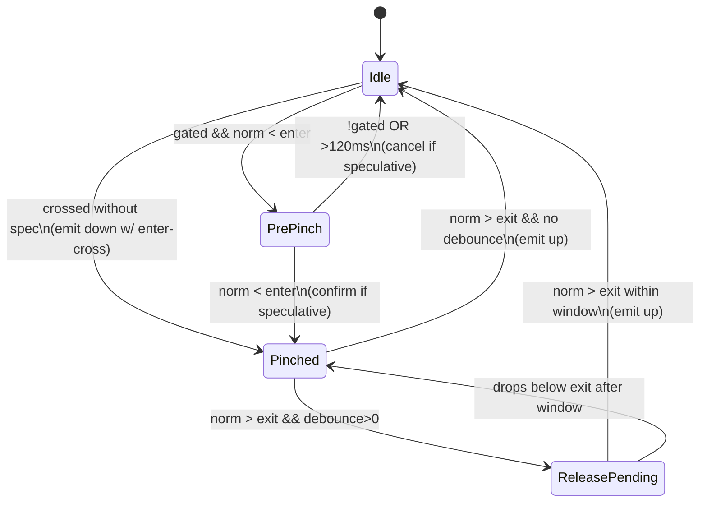

<!--
STIGMERGY REVIEW HEADER
Status: Pending verification
Review started: 2025-09-16T19:48-06:00
Expires: 2025-09-23T19:48-06:00 (auto-expire after 7 days)

Checklist:
- [ ] Re-evaluate this artifact against current Hexagonal goals
- [ ] Validate references against knowledge manifests
- [ ] Log decisions in TODO_2025-09-16.md
-->

# Pinch Core — Plain-Language Flow and Graphs

This explains how `createPinchCore` works: data flow, state machine, and where speculative signals can mislead. Use it to verify and debug “speculative down/up”.

## Inputs and Outputs

- Inputs per frame:
  - t (ms), indexTip [x,y,z], thumbTip [x,y,z]
  - wrist, indexMCP, pinkyMCP required for gating and scaling; other finger joints optional
- Config highlights:
  - Thresholds: enter=0.50, exit=0.72; enterDebounce=0ms, exitDebounce=40ms
  - Gating: palm cone <=30° (must be computable from wrist/MCPs) and kinematic sanity check
  - Scaling: knuckle span derived from indexMCP↔pinkyMCP (or fixed override); no fallback constant
  - Speculation: enableSpeculative=true if toiV in (-40..120)ms and gated
  - Safety: autoRelease=5000ms, holdTick=200ms
- Returned fields:
  - state, normalizedGap (norm), rawNormalizedGap, isGated, palmAngleDeg
  - pinchVelocity (vRel), pinchAcceleration (aRel)
  - msToTouchVel (toiV), msToTouchAccel (toiA)
  - predictedEnterTimeMsVel/Accel, approachStopTimeMs (toiActualStop)
  - thresholds, abs.distCm (informational), landmarksRaw, debug
- Events:
  - pinch:down, pinch:confirm, pinch:hold, pinch:up, pinch:cancel, pinch:toiActualStop

## Data flow

```mermaid
flowchart LR
  A[Frame\n t, indexTip, thumbTip\n wrist, indexMCP, pinkyMCP?] --> B[OneEuro filters\n ix,iy,iz, tx,ty,tz]
  A --> C[Knuckle span (kn)\n fixed or indexMCP↔pinkyMCP\n no fallback]
  B --> D[Distances\n rawDist, smDist]
  C --> D
  D --> E[Normalize\n rawNorm=rawDist/kn\n norm=smDist/kn]
  E --> F[Derivatives\n vRel, aRel\n Rolling medians]
  A --> G[Palm angle\n wrist,indexMCP,pinkyMCP]
  F --> H[Gating\n palmCone<=30° AND\n |v|,|a| below bounds]
  G --> H
  F --> I[TOI to 0\n toiV, toiA]
  E --> I
  F --> J[ETA to enter\n sEnter=norm-enter\n toiPredAbsV/A]
  E --> J
  H --> K[State machine]
  I --> K
  J --> K
  K --> L[Events]
  K --> M[Return object]
```

Notes:

- toiV ≈ norm / |vRel| when approaching (vRel<0); toiA solves 0.5·a·t² + v·t + s = 0
- Gating requires a computable palm angle and it within cone AND kinematics within robust median bounds
- toiActualStop emits when vRel crosses 0 (approach stops), time interpolated

## State machine



Speculation (Idle → PrePinch):

- If enableSpeculative && gated && toiV in (-40..120)ms, emit pinch:down with speculative=true and predicted timestamps (predictedEnterTimeMsVel/Accel, toiZeroAbsV/A)
- Confirm when actual enter is crossed; otherwise cancel after ~120ms or gate loss

Release:

- In Pinched, norm>exit triggers debounce window (60ms) then up; otherwise immediate up
- Auto-release at 5s guard

Holds:

- In Pinched, every holdTickMs emit pinch:hold with duration since lastDown

## Risk points (why it might feel wrong)

- Knuckle span fallback (0.08) mis-normalizes when MCPs missing → wrong thresholds/TOI
- Gate too permissive: 30° cone + broad kinematic bounds can arm speculation on noise
- Spec window (-40..120ms) may produce early downs that cancel on slowdown
- Exit debounce hides brief exits → “sticky” up
- Interpolated times vs frame timestamps can look off at low FPS

## Quick probes

- Track confirm/cancel counts for speculative downs on real clips and live
- Log toiV at down; expect confirms clustered within ~120ms if approach continues

// EMBER:FS-2025-023:WARM: Speculative down confirm/cancel ratio needs measurement on live vs clip
