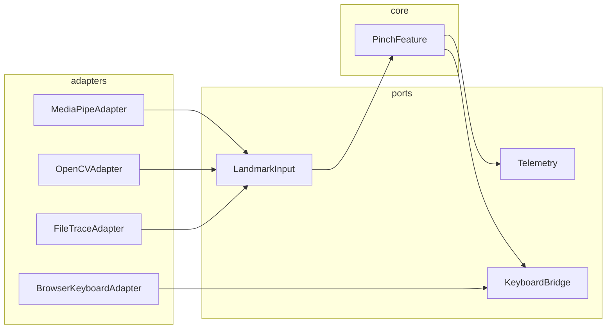

# Hexagonal Core Spec — Tectangle (Design Draft)
CreatedAt: 2025-09-07T04:32:00Z
Author: auto-generated (architect)

TL;DR  
Define a small, testable Hexagonal core for pinch detection and pinch→keypress emission (LandmarkInput → PinchFeature → KeyboardBridge), expose narrow, versioned ports, and migrate existing prototypes/adapters behind those ports using a Strangler‑Fig approach. Evidence & inputs: inventory & scans (see [`docs/doc_inventory.json`](docs/doc_inventory.json:1), [`docs/knowledge/code_scan_artifacts.json`](docs/knowledge/code_scan_artifacts.json:1)), diagnostics (see [`September2025/Tectangle/diagnostics/TESTS_VS_DEMO_ROOT_CAUSE_2025-09-06.md`](September2025/Tectangle/diagnostics/TESTS_VS_DEMO_ROOT_CAUSE_2025-09-06.md:1)).

Goals and non‑goals
- Goals: provide a tiny, deterministic domain core (PinchFeature) with well‑typed ports and a clear adapter surface so demos, tests and CI can validate behavior independent of I/O. (See consolidated decision docs: [`docs/knowledge/Consolidated_Pinch_Report_2025-09-06_FINAL.md`](docs/knowledge/Consolidated_Pinch_Report_2025-09-06_FINAL.md:1).)
- Non‑goals: rewrite all legacy code now — prefer incremental migration using Strangler‑Fig.

1. Design principles (short)
- Domain purity: core logic should have zero DOM/browser APIs, only pure functions + small state.
- Ports & Adapters: define minimal contracts for each external capability (landmarks, keyboard, telemetry, clock).
- Test-first: domain covered by deterministic golden traces and unit tests.
- Observability and safe migration: backups + CI smoke harness for every change (see project progress & diagnostics) (`[`docs/knowledge/project_progress_summary_20250906.md`](docs/knowledge/project_progress_summary_20250906.md:1)`).

2. Core concepts & event shapes
- Controller (hand): stable controllerId, lastSeenTs, calibration (knuckle span).
- PinchEvent (canonical):
  - { event: 'pinch:down' | 'pinch:up', controllerId, finger: 'index'|'middle'|..., anchor: {x,y,z}, palmQuat?, frameId, ts }
- Telemetry envelope: minimal scalar counters + golden trace writer.

3. Ports (API contracts)
- LandmarkInput port: supplies per-frame landmark bundles (21 points). Suggested TypeScript interface (spec-only):  
  [`typescript.declaration()`](src/ports/LandmarkInput.ts:1)
```typescript
export interface LandmarkFrame {
  frameId: number;
  tsMs: number;
  landmarks: Array<{ x:number; y:number; z:number | null }>; // 21 points per hand or empty
  handedness?: 'Left' | 'Right' | 'Unknown';
}
export interface LandmarkInput {
  subscribe(callback: (frame: LandmarkFrame)=>void): () => void; // returns unsubscribe
  readOnce(): Promise<LandmarkFrame>; // optional for replay/traces
}
```

- PinchFeature port (domain contract): pure logic that consumes LandmarkFrame and emits canonical events:  
  [`typescript.declaration()`](src/ports/PinchFeature.ts:1)
```typescript
export type PinchEvent = { event: 'pinch:down'|'pinch:up', controllerId: string, finger: string, anchor: {x:number,y:number,z?:number}, tsMs:number };
export interface PinchFeature {
  onEvent(cb: (e: PinchEvent)=>void): () => void;
  processFrame(frame: LandmarkFrame): void; // pure invocation for replay tests
  getState(controllerId:string): any; // for diagnostics/smoke checks
}
```

- Telemetry port: writes counters, traces, and golden JSONL.  
  [`typescript.declaration()`](src/ports/Telemetry.ts:1)
```typescript
export interface Telemetry {
  increment(metric: string, n?: number): void;
  writeGolden(frame: LandmarkFrame, meta?: object): void; // append JSONL
  flush(): Promise<void>;
}
```

- KeyboardBridge port: emits page-level or native key events (adapter chooses method):  
  [`typescript.declaration()`](src/ports/KeyboardBridge.ts:1)
```typescript
export interface KeyboardBridge {
  emitKeyDown(key: string, meta?: object): void;
  emitKeyUp(key: string, meta?: object): void;
}
```

4. Adapter catalogue (examples)
- MediaPipeAdapter: implements LandmarkInput using MediaPipe / Human (evidence: many mediapipe hits in inventory) (see [`docs/knowledge/code_scan_artifacts.json`](docs/knowledge/code_scan_artifacts.json:1)).
- OpenCVAdapter: optional image-based fallback (inventory shows OpenCV references).
- FileTraceAdapter: replay golden JSONL as LandmarkInput for tests (see golden traces in scan: [`docs/knowledge/code_scan_artifacts.json`](docs/knowledge/code_scan_artifacts.json:1)).
- BrowserKeyboardAdapter: implements KeyboardBridge using `KeyboardEvent` (for demos).
- NativeKeyboardAdapter: WebSocket → native process (keyboard bridge protocol exists in prototype docs).

5. Minimal runtime wiring (orchestrator)
- Provide a small runner that composes: LandmarkInput -> PinchFeature -> KeyboardBridge + Telemetry. The runner only wires ports and handles lifecycle (start/stop).
- Start with a demo runner (in prototype) to reuse existing pages; later extract runner into worker processes.

Mermaid (high-level architecture)


6. Strangler‑Fig migration plan (incremental)
- Phase 0 (Non‑breaking verification): Add PinchFeature as a pure library and cover it with unit tests against existing golden traces (no code moves). Evidence: golden traces & smoke harness exist (see [`docs/knowledge/code_scan_summary_20250907.md`](docs/knowledge/code_scan_summary_20250907.md:1)).
- Phase 1 (Facade + dual-write): Insert a tiny facade `PinchFacade` in prototype bootstrap that delegates to old path and to the new PinchFeature; log counts to Telemetry. Acceptance: identical events in both paths for canonical golden traces (smoke pass).
- Phase 2 (Switch adapters): Replace specific adapters (e.g., prototype's direct CameraManager) with MediaPipeAdapter wiring to LandmarkInput; run smoke harness.
- Phase 3 (Migrate managers): Move additional manager responsibilities into small adapters and mark old code as deprecated/archived (use `archive-stale/` snapshot approach).
- Safety: require backup snapshot before each migration (PR header: BACKUP-CREATED:), golden-trace update, and CI smoke pass.

7. Testing & CI expectations
- Domain unit tests: pure deterministic tests for PinchFeature using synthetic frames and golden traces (see test harness: [`docs/knowledge/code_scan_artifacts.json`](docs/knowledge/code_scan_artifacts.json:1)).
- Integration tests: replay golden JSONL via FileTraceAdapter and assert emitted PinchEvents at expected timestamps (smoke harness).
- Demo smoke: headless browser load prototype pages and assert console event logs (existing smoke tests references in inventory).
- CI: add header-check workflow to enforce file metadata and require BACKUP-CREATED lines in PR templates.

8. Observability & operational rules
- Telemetry minimum: `telemetry.pinch.count` and golden trace writer per session (non-blocking).
- Snapshot policy: before any automated edit create `archive-stale/migration_snapshot_<ts>/` (we already have such snapshots) (see snapshot manifest: [`archive-stale/migration_snapshot_20250906T225754Z/manifest.json`](archive-stale/migration_snapshot_20250906T225754Z/manifest.json:1)).
- Guarded bootstrap: avoid top-level unguarded `await` in prototypes (diagnosed: [`September2025/Tectangle/diagnostics/TESTS_VS_DEMO_ROOT_CAUSE_2025-09-06.md`](September2025/Tectangle/diagnostics/TESTS_VS_DEMO_ROOT_CAUSE_2025-09-06.md:1)).

9. Incremental deliverables (suggested)
- Deliverable A (days): PinchFeature library + unit tests; FileTraceAdapter + smoke replay. (owner: engineer)
- Deliverable B (1 week): Facade and dual-write in prototype + add Telemetry; run smoke harness. (owner: engineer)
- Deliverable C (2–3 weeks): Extract adapters for MediaPipe and KeyboardBridge + CI golden-trace gating. (owner: team)

10. Acceptance criteria
- PinchFeature unit tests pass, smoke harness reproduces canonical events within tolerance, and demo page responds to synthetic pinch-to-key mapping reliably across two browsers.

Appendix — references (evidence)
- Inventory & scans: [`docs/doc_inventory.json`](docs/doc_inventory.json:1), [`docs/knowledge/code_scan_artifacts.json`](docs/knowledge/code_scan_artifacts.json:1)
- Git timeline & progress: [`docs/knowledge/git_timeline.svg`](docs/knowledge/git_timeline.svg:1), [`docs/knowledge/project_progress_summary_20250906.md`](docs/knowledge/project_progress_summary_20250906.md:1)
- Core docs & diagnostics: [`September2025/Tectangle/docs/pinch_feature_plan.md`](September2025/Tectangle/docs/pinch_feature_plan.md:1), [`September2025/Tectangle/docs/pinch_mvp_decision.md`](September2025/Tectangle/docs/pinch_mvp_decision.md:1), [`September2025/Tectangle/diagnostics/TESTS_VS_DEMO_ROOT_CAUSE_2025-09-06.md`](September2025/Tectangle/diagnostics/TESTS_VS_DEMO_ROOT_CAUSE_2025-09-06.md:1)
- Consolidated summary: [`docs/knowledge/Consolidated_Pinch_Report_2025-09-06_FINAL.md`](docs/knowledge/Consolidated_Pinch_Report_2025-09-06_FINAL.md:1)

Next step
- I will create the canonical spec file at [`docs/design/hexagonal_core_spec.md`](docs/design/hexagonal_core_spec.md:1). Please confirm and I will write it now.
</message>
</new_task>