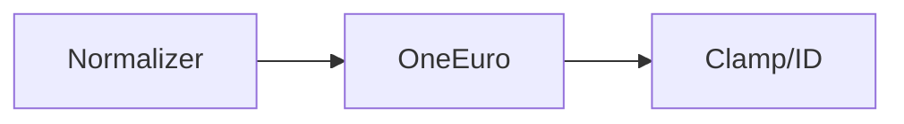
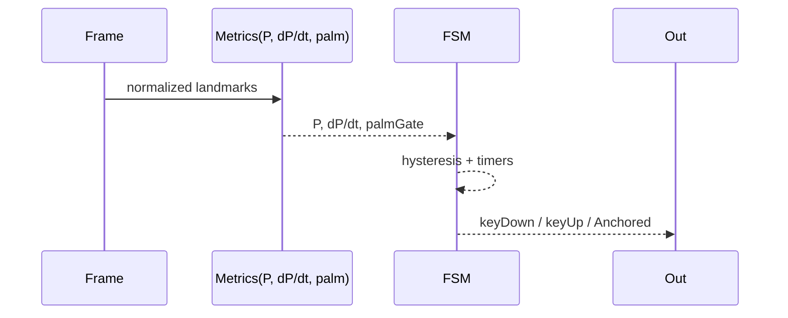

Adapters Everywhere — Universal “Lego” Architecture for PinchFSM
================================================================

Metadata
--------

- title: Adapters Everywhere — Universal “Lego” Architecture for PinchFSM
- doc_type: two-pager
- timestamp: 2025-09-05T00:00:00Z
- tags: [ports-and-adapters, hexagonal, pipes-and-filters, strangler-fig, adapters, resilience, pinchfsm]
- summary: A resilient, composable pipeline using Ports & Adapters + Pipes & Filters so we can swap producers (Human/MediaPipe), normalize/repair frames, smooth/predict, run an FSM, and emit outputs (Keyboard/MIDI) without brittle coupling.

Page 1 — Core ideas & why this works
------------------------------------

The problem we’re solving

- Inputs drift (coordinate spaces, missing points, FPS, device variance).
- We want deterministic offline replay and robust live UX with the same logic.
- We must avoid “fighting” any specific vendor app (Human) and still be able to swap stacks.

Two proven architectural patterns combined

1) Ports & Adapters (Hexagonal Architecture)
   - Domain core exposes stable ports (interfaces). Adapters sit at the edges to translate to/from concrete systems.
   - Effect: low coupling, easy swapping (Human ↔ MediaPipe ↔ Recorded JSONL), testable core.

2) Pipes & Filters (Streaming Pipeline)
   - Each stage transforms a frame (normalize → filter → stabilize → metrics → FSM → outputs).
   - Effect: composability, per-stage health, fault isolation, deterministic replay.

Bonus patterns that fit here

- Strangler Fig: wrap an existing app (Human demo) and progressively replace pieces via adapters.
- Event Sourcing/Replay: store raw frames (goldens) and deterministically replay through the pipeline.
- Bulkhead + Fallbacks: on stage failure, degrade gracefully (skip/hold/predict) without crashing.

High-level architecture (hexagonal)

```mermaid
flowchart LR
  subgraph Outside[Producers / Consumers]
    A[Camera + Human]
    B[MediaPipe / JSONL Replay]
    C[Keyboard / WebMIDI / Game]
  end

  subgraph Core[Domain Core (Stable Ports)]
    P1((Port: FrameIn))
    P2((Port: EventsOut))
    subgraph Pipeline[Pipeline (Pipes & Filters)]
      N[Normalizer]
      F[Filters (OneEuro)]
      S[Stabilizers (Clamp/ID)]
      M[Metrics (P, dP/dt)]
      X[FSM (Open→Possible→Pinch→Anchored)]
    end
  end

  A-->|HumanAdapter|P1
  B-->|ReplayAdapter|P1
  P1-->N-->F-->S-->M-->X-->P2
  P2-->C
```

Data contract (tiny, stable)

- FrameIn: `{ tMs, frameIndex?, hands: [{ landmarks: [{x,y,z?}] , box? , handedness? }] }`
- EventsOut: `[{ tMs, type: 'pinch_enter'|'pinch_exit'|'anchored', velocity?, confidence? }]`

Stage responsibilities (single-purpose)

- Normalizer: coordinate systems → normalized [0..1], ordering, handedness inference, missing-point repair.
- Filters: OneEuro presets (minCutoff/beta) for tips/points; paramizable by profile.
- Stabilizers: clamping teleports, controller ID mapping, dead-frames hold.
- Metrics: P=dist(4,8)/dist(5,17), dP/dt, palm normal.
- FSM: hysteresis thresholds, debounce, anchorHold, palm gate, keyDown/keyUp.
- Outputs: KeyboardAdapter (Space), WebMIDIAdapter (future), TelemetryAdapter (metrics, counters).

Page 2 — Practical build for this repo (step-by-step)
-----------------------------------------------------

1) Adapters layer (Edges)

- HumanAdapter (live):
  - Input: `human.detect()` or `human.result` (keypoints|landmarks, pixels|normalized).
  - Output: FrameIn normalized to [0..1], 21 points, consistent index map.
  - Health: {kpCount, boxPresent, coordMode, fpsEstimate}.

- ReplayAdapter (offline):
  - Input: JSONL frames (goldens).
  - Output: FrameIn with canonical timestamps (frameIndex → tMs).

- OutputAdapters:
  - KeyboardAdapter: keydown/keyup mapping (Space default).
  - WebMIDIAdapter: noteOn/noteOff/aftertouch (later).

1) Filters & Stabilizers (Middle)



- OneEuro: per-tip filters (4, 8) or whole-hand if needed.
- Clamp/ID: freeze sudden wrist jumps; maintain stable controller IDs.

1) Metrics & FSM (Core)



- Contract: `update(tMs, P, gated) → {state, keyDown, keyUp}` (see `src/fsm/pinchFsm.mjs`).
- Deterministic: same inputs → same events (replayable).

1) Resilience / Missing data policy

- Missing hand this frame → hold last good for N ms, else mark as dropped.
- K≈0 (index_mcp vs pinky_mcp too small) → gate=false this frame.
- Bad/out-of-range coords → normalize/clamp to [0..1], else drop frame.
- Optional predictor: linear extrapolation for 1-frame look-ahead when dP/dt stable.

1) Observability

- Per-stage counters: dropped frames, clamped frames, gate-offs, FSM flips.
- Badges/HUD derived from adapter health + FPS.
- Replay reports compare event timelines to goldens; fail thresholds.

1) Strangler fig embedding (optional)

- Wrap the Human demo: inject a small adapter script that listens for results, runs pipeline, sends outputs. Gradually replace demo pieces with our adapters.

1) Minimal module map (this repo)

- `src/adapters/humanAdapter.mjs` (NEW): normalize Human to FrameIn + health.
- `src/filters/oneEuro.mjs` (EXISTS): smoothing presets.
- `src/kinematics/clamp.mjs` (EXISTS): jump clamp.
- `src/fsm/pinchFsm.mjs` (NEW): deterministic FSM.
- `src/metrics/pinch.mjs` (NEW): P, dP/dt, palm normal helpers.
- `src/outputs/keyboardAdapter.mjs` (NEW): keydown/keyup.
- `dev-ui/live-bridge.html` (EXISTS): demo shell wires adapters.
- `scripts/replay-runner.mjs` (NEXT): offline replay → events JSONL.

1) Test strategy

- Unit: adapters (shape convert), metrics (P, palm), FSM transitions, filters (monotonicity).
- Integration: JSONL replay → identical events vs frozen; CI gates.
- Smoke: live page shows non-null P and badge counts reflect reality.

1) Why this won’t be brittle

- Any producer can feed `FrameIn`; any consumer can subscribe to `EventsOut`.
- Each stage has a simple, testable contract.
- Swapping Human ↔ MediaPipe ↔ Replay requires changing only the edge adapter.

Appendix — Quick badge interpretation
------------------------------------

- Camera: on (OK) — media stream started.
- Human: loaded (OK) — models initialized.
- Hands: N • KP: M — producer delivered M keypoints for first hand (21 expected).
- State: … — FSM phase.
- Gate: on/off — palm normal heuristic (mirror may invert; flip logic if needed).
- Key: up/down — whether keyboardAdapter sent keydown and not yet keyup.
- FPS: X — inference+draw rate; 9–12 fps is expected on WASM @ 640×480 CPU. Try WebGL backend or 320×240.

If Hands>0 & KP=21 but no dots:

- Coordinates may be pixel space; ensure Normalizer divides by canvas size.
- CSS mirror only flips video; overlay needs matching interpretation but should still show dots.
- Check P is not NaN; if NaN, some points are undefined → add adapter repair or fallback.

End.
