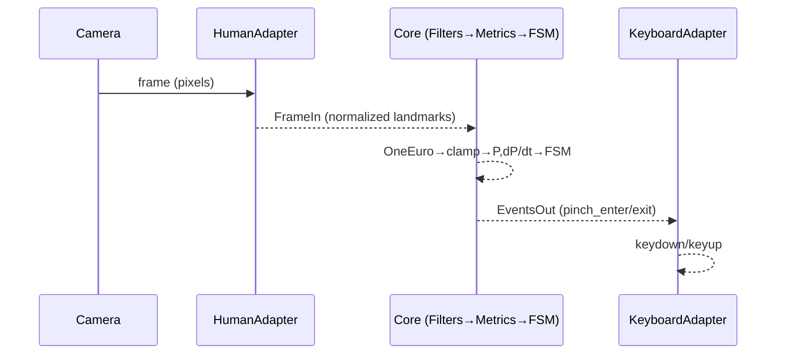

Hexagonal Architecture (Ports & Adapters) — Two‑Pager for PinchFSM
=================================================================

Metadata
--------

- title: Hexagonal Architecture (Ports & Adapters) — Two‑Pager for PinchFSM
- doc_type: two-pager
- timestamp: 2025-09-05T00:00:00Z
- tags: [hexagonal, ports-and-adapters, adapters, pipes-and-filters, strangler-fig, testing]
- summary: An accessible intro to Hexagonal Architecture and how we apply it to PinchFSM so inputs/outputs are swappable, the core stays stable, and tests are deterministic.

Page 1 — What & Why (with 5 sequential thinking passes)
-------------------------------------------------------

Plain‑language definition

- Hexagonal Architecture separates your core domain logic from the outside world using Ports (interfaces) and Adapters (edge converters). Your core doesn’t know if data comes from Human, MediaPipe, or a JSONL replay; it only sees a stable contract. Likewise, outputs (keyboard, MIDI) are pluggable.

Sequential thinking (5 quick passes)

1. Frame the problem (What changes, what must not?)
   - Inputs drift (coordinate spaces, FPS, device). Outputs vary (games, MIDI).
   - Must not change: deterministic FSM behavior under the same landmark frames.

1. Define the core (What is the “business logic” here?)
   - Core = smoothing + stabilizers + metrics + FSM transitions (Open → Possible → Pinch → Anchored) producing events.
   - The core consumes a stable Frame port and emits an Events port.

1. Encapsulate edges (How do we isolate volatility?)
   - Input adapters translate Human/MediaPipe/JSONL to the Frame port (normalize, repair, timestamp).
   - Output adapters translate Events to keyboard/WebMIDI/telemetry.

1. Make it testable (How do we keep proof?)
   - Record traces once (goldens). Replay through the ports. Assert identical Events. CI runs this on every PR.

1. Evolve safely (How do we add features without breaking?)
   - Add new adapters (e.g., new hand tracker, new output), keep the core untouched.
   - Use a Strangler Fig to wrap existing demos and gradually replace parts.

High‑level diagram (hexagonal view)

```mermaid
flowchart LR
  subgraph Core[PinchFSM Core]
    P_in((Port: FrameIn))
    P_out((Port: EventsOut))
    F[Filters & Stabilizers]
    M[Metrics (P, dP/dt, palm)]
    S[FSM (Open→Possible→Pinch→Anchored)]
    P_in-->F-->M-->S-->P_out
  end

  subgraph Inputs[Input Adapters]
    H[HumanAdapter]
    MP[MediaPipeAdapter]
    R[ReplayAdapter]
  end

  H-->|normalize/repair|P_in
  MP-->|normalize/repair|P_in
  R-->|canonical timestamps|P_in

  subgraph Outputs[Output Adapters]
    K[KeyboardAdapter]
    W[WebMIDIAdapter]
    T[TelemetryAdapter]
  end
  P_out-->|keydown/keyup|K
  P_out-->|noteOn/noteOff|W
  P_out-->|counters/logs|T
```

Small, stable contracts

- FrameIn: `{ tMs, frameIndex?, hands: [{ landmarks: [{ x, y, z? } x21 ], box?, handedness? }] }`
- EventsOut: `[{ tMs, type: 'pinch_enter'|'pinch_exit'|'anchored', velocity?, confidence? }]`

Page 2 — How we apply it here (concrete mapping)
------------------------------------------------

Components we already have

1. Filters/Stabilizers
   - OneEuro filter (`src/filters/oneEuro.mjs`), ControllerTracker, kinematic clamp (`src/kinematics/clamp.mjs`).

1. FSM
   - `src/fsm/pinchFsm.mjs` with tests (`tests/pinchfsm.test.mjs`). Debounce, hysteresis, anchorHold, gate.

1. Replay & determinism
   - JSONL goldens, freeze/verify, integration test parity, CI wired.

What to add next (adapters & metrics)

1. HumanAdapter (Input)
   - Accept `human.detect()` or `human.result` (keypoints/landmarks, pixels/normalized).
   - Normalize to [0..1]; ensure 21 points in correct order; add health (kpCount, coordMode). Output = FrameIn.

1. Metrics module (Core helper)
   - `P = dist(4,8)/dist(5,17)`, `dP/dt`, palm normal; handle K≈0 safely (gate=false that frame).

1. KeyboardAdapter (Output)
   - Inject keydown/keyup to same‑origin iframe or page; add fallback if iframe blocked.

Live pipeline (sequence)



Resilience & fallbacks (where adapters help)

1. Missing data
   - If a landmark is missing, interpolate from last good or skip the frame (adapter policy, configurable).

1. Coordinate confusion
   - Detect coord mode (pixels vs normalized) and convert; expose this in debug badges.

1. Gate polarity
   - Flip palm gate sign via config when cameras mirror/invert.

1. Performance
   - Lower res or skip frames at adapter edge; core logic unchanged.

Testing plan (practical)

1. Unit
   - HumanAdapter: various Human shapes → FrameIn OK; coord mode detection works.
   - Metrics: P and palm; edge cases for K≈0.
   - FSM: already covered.

1. Integration
   - ReplayAdapter → Core → compare EventsOut vs golden events (when we add events golden).

1. Live smoke
   - Badge shows KP:21; P not NaN; dots render; Space toggles in iframe.

Strangler Fig option (if we want to embed in Human demo)

- Load a small adapter script in the Human demo page that subscribes to results, runs our pipeline through ports, and emits keyboard/MIDI. Gradually move visuals/controls over to our shell without forking their code.

Adoption checklist (low‑risk)

1. Build `src/adapters/humanAdapter.mjs` + tests.
1. Build `src/metrics/pinch.mjs` + tests.
1. Refactor `dev-ui/live-bridge.html` to call adapters instead of inline heuristics and add a “flip gate” toggle.
1. Add a tiny `KeyboardAdapter` module used by both live page and tests.
1. Later: add `scripts/replay-runner.mjs` to generate events JSONL and freeze an events golden.

End.
