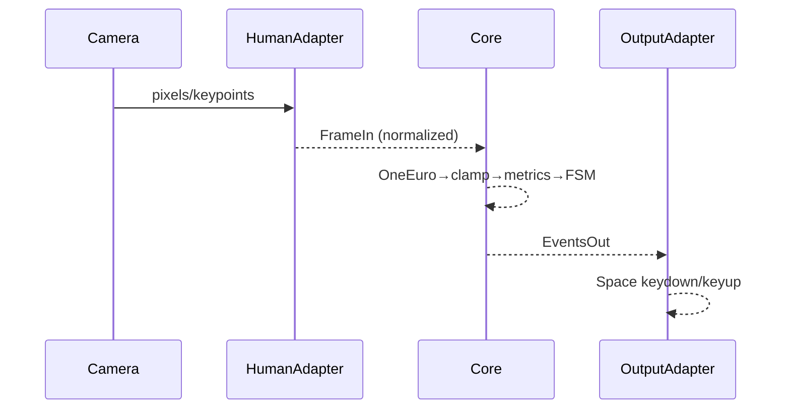

Hexagonal Architecture + Sequential Thinking (5×) — PinchFSM
============================================================

Metadata
--------

- title: Hexagonal Architecture + Sequential Thinking (5×) — PinchFSM
- doc_type: two-pager
- timestamp: 2025-09-05T00:00:00Z
- tags: [hexagonal, ports-and-adapters, sequential-thinking, adapters, pipes-and-filters, strangler-fig]
- summary: A step-by-step (5×) way to apply Hexagonal (Ports & Adapters) + Pipes & Filters to PinchFSM so it’s modular, testable, and resilient.

Page 1 — 5× Sequential Thinking
-------------------------------

1) Clarify invariants vs volatility

- Volatile: producers (Human/MediaPipe/Webcam/Replay), coordinate modes (pixels vs normalized), FPS, missing points; consumers (keyboard, MIDI, games).
- Invariant: the deterministic core that converts landmarks → events (pinch_enter/exit/anchored) given time-stamped frames.

1) Define the core and its ports

- Core pipeline: Filters (OneEuro) → Stabilizers (clamp/ID) → Metrics (P, dP/dt, palm) → FSM (Open→Possible→Pinch→Anchored).
- Ports: FrameIn (input) and EventsOut (output).

1) Isolate volatility with adapters

- Input adapters: HumanAdapter, MediaPipeAdapter, ReplayAdapter convert raw sources → FrameIn (normalize, repair, timestamp).
- Output adapters: KeyboardAdapter, WebMIDIAdapter, TelemetryAdapter convert EventsOut → side effects.

1) Add resilience & health

- Normalize coordinates; detect coord mode. Repair missing points or hold last-good for N ms. If K≈0, set gate=false. Optional 1-frame prediction when dP/dt is stable. Track counters per stage.

1) Operationalize for change

- Unit tests for adapters/metrics/FSM. Integration replay tests against goldens. CI gating. Strangler Fig embedding if we run inside Human demo. Small PRs and feature flags for risky changes.

Page 2 — Diagrams & concrete mapping
------------------------------------

Hexagonal view

```mermaid
flowchart LR
  subgraph Core[PinchFSM Core]
    P_in((Port: FrameIn))
    P_out((Port: EventsOut))
    F[Filters & Stabilizers]
    M[Metrics (P, dP/dt, palm)]
    S[FSM]
    P_in-->F-->M-->S-->P_out
  end

  subgraph Inputs[Inputs]
    H[HumanAdapter]
    MP[MediaPipeAdapter]
    R[ReplayAdapter]
  end
  H-->|normalize|P_in
  MP-->|normalize|P_in
  R-->|timestamps|P_in

  subgraph Outputs[Outputs]
    K[KeyboardAdapter]
    W[WebMIDIAdapter]
    T[TelemetryAdapter]
  end
  P_out-->|keydown/keyup|K
  P_out-->|noteOn/off|W
  P_out-->|metrics|T
```

Live sequence



Concrete actions in this repo

1. Add `src/adapters/humanAdapter.mjs` (normalize to FrameIn; expose coordMode, kpCount) + unit tests.
1. Add `src/metrics/pinch.mjs` (P, dP/dt, palm normal) + tests.
1. Refactor `dev-ui/live-bridge.html` to use adapters; add “flip gate” and show coordMode in badges.
1. Create `src/outputs/keyboardAdapter.mjs` used by live and future tests.
1. Add `scripts/replay-runner.mjs` that reads JSONL → EventsOut and writes events JSONL; later freeze events goldens.

Tiny contracts (copy‑paste)

- FrameIn
  - `{ tMs, frameIndex?, hands: [{ landmarks: [{ x, y, z? } x21 ], box?, handedness? }] }`
- EventsOut
  - `[{ tMs, type: 'pinch_enter'|'pinch_exit'|'anchored', velocity?, confidence? }]`

Why this will feel robust

- Producers and consumers are replaceable lego blocks.
- Core logic is deterministic and replayable.
- Each stage is tiny and testable; failures degrade gracefully.

End.
