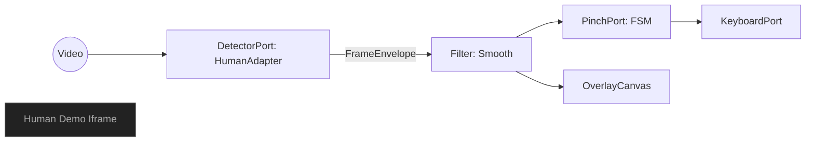

# Lego Design Principles: One Shape, Everything Connects

Date: 2025-09-05
Owner: You
Status: Draft → P0 actionable

## The Metaphor

- Lego works because every brick shares the same studs-and-tubes connector. Shapes vary, but the connection contract is invariant.
- Translate to software: define one stable “Shape” (data contract) and one simple “Connector” (port). Everything snaps to that, not to each other.

## Core Principles (battle‑tested)

- One Shape First
  - Define a canonical, versioned data shape that all modules consume/produce.
  - Small, explicit, forward‑compatible; add via optional fields, never breaking existing.
- Ports & Adapters (Hexagonal)
  - Domain is pure and depends on nothing. Adapters implement ports to talk to the world.
  - Replace vendors by swapping adapters; domain stays unchanged.
- Composition Over Inheritance
  - Build pipelines of tiny filters/components. Each does one job, returns the Shape.
- Deterministic, Idempotent Steps
  - Given the same input Shape, output is the same. Avoid hidden global state.
- Stable Seams, Evolving Internals
  - Freeze contracts at seams (ports/messages). Refactor internals safely behind them.
- Declarative Wiring
  - Keep “how to connect” out of modules. Use small shells to compose ports and filters.
- Test the Contract, Not the Vendor
  - Contract tests and goldens guard behavior. Vendor systems are integration details.

## What Works

- Uniform connectors (one Shape everywhere): reduces glue code and regressions.
- Strong typing/validation at boundaries (Zod/schema): fail fast, clear logs, good DX.
- Event/log centric flows: JSONL/GJSON goldens; replay for debugging and CI.
- Small pure filters: easy to unit‑test; predictable latency.
- Adapters for external systems (Human, Keyboard, UI): painless swaps/mocks.

## What Doesn’t

- Leaky adapters that expose vendor internals into domain types.
- Brittle temporal coupling (modules depending on timing side‑effects, globals).
- God objects carrying everything; unclear ownership of fields.
- Silent implicit conversions (pixels↔normalized) without Shape‑level policy.

## Your One Shape (proposal)

Name: FrameEnvelope v1

- header
  - tsMs: number (monotonic frame timestamp)
  - controllerId: string (left/right/auto)
  - source: 'camera' | 'file' | 'demo'
- hand
  - landmarks: Array[21] of { x: number; y: number; z?: number } (normalized [0..1])
  - coordMode: 'normalized'
  - boxPx?: { x: number; y: number; width: number; height: number }
- metrics
  - fps?: number
  - vendor?: { kpCount?: number; backend?: string }

Rules:

- All modules must input and output FrameEnvelope.
- Modules can add fields under their namespace (e.g., metrics.vendor) without breaking others.
- No module may remove or rename existing fields.

## Ports (Connectors)

- Inbound: DetectorPort
  - detect(source) → FrameEnvelope | null
- Domain: PinchPort
  - update(envelope) → { state, keyDown?, keyUp? }
- Outbound: KeyboardPort
  - keydown(key), keyup(key)
- Observability: MetricsPort
  - tick() → { fps }

## Apply It Here (concrete moves)

- Define Shape
  - Create `src/contracts/frameEnvelope.mjs` with Zod schema + version tag.
  - Add a tiny validator `assertEnvelope()` for all boundaries.
- Adapt Human
  - Update `HumanAdapter.detect()` to produce FrameEnvelope (normalized [0..1]).
  - Include `metrics.vendor.kpCount` and `metrics.vendor.backend`.
- Keep Domain Pure
  - Wrap `PinchFSM.update()` so it only reads `envelope.hand.landmarks` and returns events.
- Output Port
  - `KeyboardAdapter` consumes events; no UI coupling.
- UI Shells (three panes)
  - Key pane: subscribes to events to light the key; no detector logic.
  - Human pane: iframe to your local demo unchanged; no coupling.
  - Camera+overlay pane: draws two dots from `envelope.hand.landmarks[4]` and `[8]`.
- CI & Goldens
  - Freeze sample FrameEnvelopes as JSONL; add schema validation in CI.
  - Backward‑compat check: older goldens must still validate.

## Minimal Diagram

## Guardrails

- Schema version in payload: `v: 1`.
- Semantic lint: forbid pixels in landmarks; only normalized.
- Logging: every adapter logs what it adds (metrics.vendor.*) and nothing else.
- Backpressure: if FPS < target, drop frames at adapter boundary, not inside domain.

## Try It (P0 steps)

1. Add `src/contracts/frameEnvelope.mjs` with Zod schema + helpers.
1. Make `HumanAdapter.detect()` return that shape; update overlay drawer to consume it.
1. Wrap `PinchFSM` with a thin adapter that takes `FrameEnvelope` and emits events.
1. Add a JSONL recorder that writes validated envelopes for quick replay tests.
